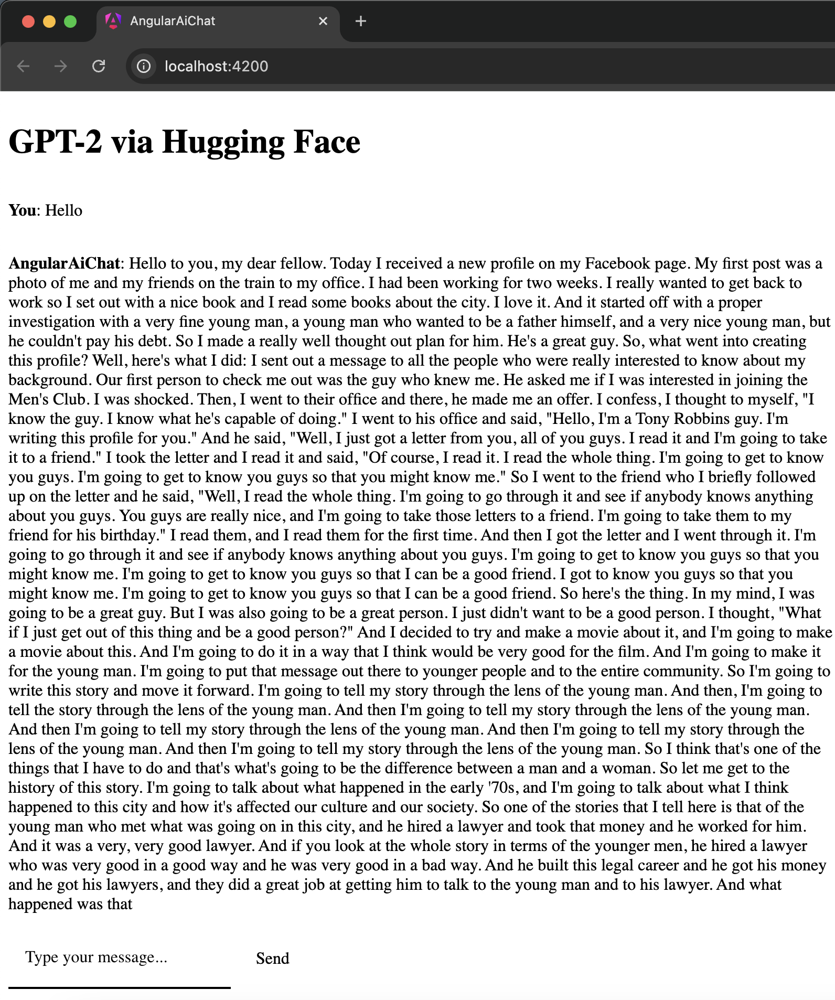

# AngularAiChat

This project was generated with [Angular CLI](https://github.com/angular/angular-cli) version 17.3.11.
It allows to use AI Chat with GPT-2 model via Hugging Face.



## Stack

- Angular 17
- Sass
- Angular MaterialUI
- RxJS
- NgRx
- Karma
- Jasmine
- Express

## CLI steps

Creation:

```sh
npm install -g @angular/cli
ng new angular-ai-chat --standalone --style=scss
```

Packages:

```sh
yarn add @angular/material @angular/cdk @angular/animations
yarn add rxjs @ngrx/store @angular/forms
yarn add axios
```

Chat component:

```sh
ng generate component chat --standalone
```

Docker:

```sh
docker build -t ai-chat-app .
docker run -p 4200:4200 ai-chat-app
```

## Runtime

At first provide your `HF_API_TOKEN` in `.env` file.

This simple Express server needs to be staged to handle CORS.

```sh
node anthropic-proxy/server.js
```

WARNING: It needs to be executed in the same directory as `.env` file is.

## Development server

Run `ng serve` for a dev server. Navigate to `http://localhost:4200/`. The application will automatically reload if you change any of the source files.

## Code scaffolding

Run `ng generate component component-name` to generate a new component. You can also use `ng generate directive|pipe|service|class|guard|interface|enum|module`.

## Build

Run `ng build` to build the project. The build artifacts will be stored in the `dist/` directory.

## Running unit tests

Run `ng test` to execute the unit tests via [Karma](https://karma-runner.github.io).

## Running end-to-end tests

Run `ng e2e` to execute the end-to-end tests via a platform of your choice. To use this command, you need to first add a package that implements end-to-end testing capabilities.

## Further help

To get more help on the Angular CLI use `ng help` or go check out the [Angular CLI Overview and Command Reference](https://angular.io/cli) page.
